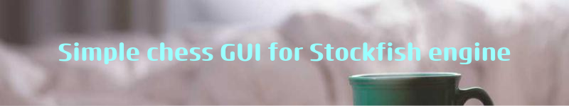

***This project is for linux systems only. It is a simple SFML based GUI that uses the stockfish engine.***
  

**Compilation** 

To compile, you need to follow these steps: 
- Of course, download this project to your disk: git clone .... 
- then go to the build directory and execute the commands: 
- cmake ../ -G "Unix Makefiles" -DCMAKE_BUILD_TYPE=Release
- make
- download and compile the stockfish engine:
https://github.com/official-stockfish/Stockfish.git 
- executable Stockfish file must be in our directory (chessStockfish), in not copy it
- move the executable file to the directory where this code is
and run the compiled program with the working name stockTest.

good luck :smiley:
